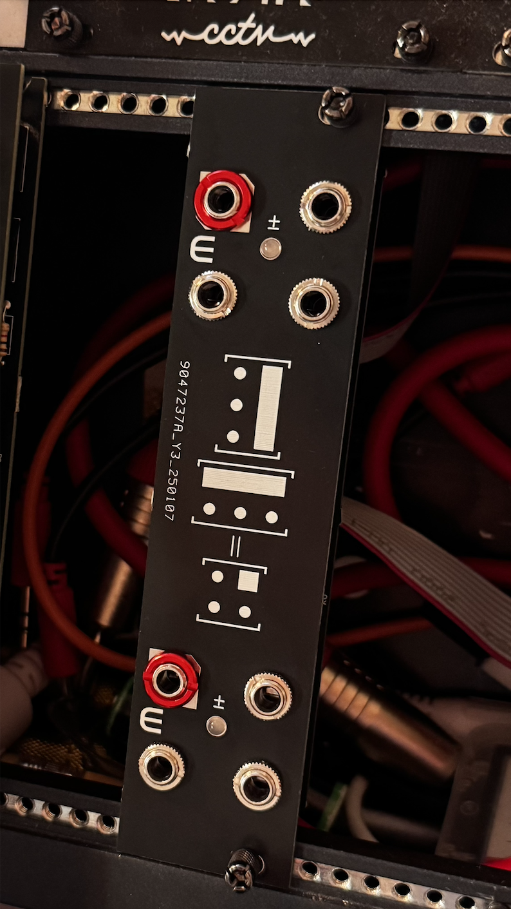
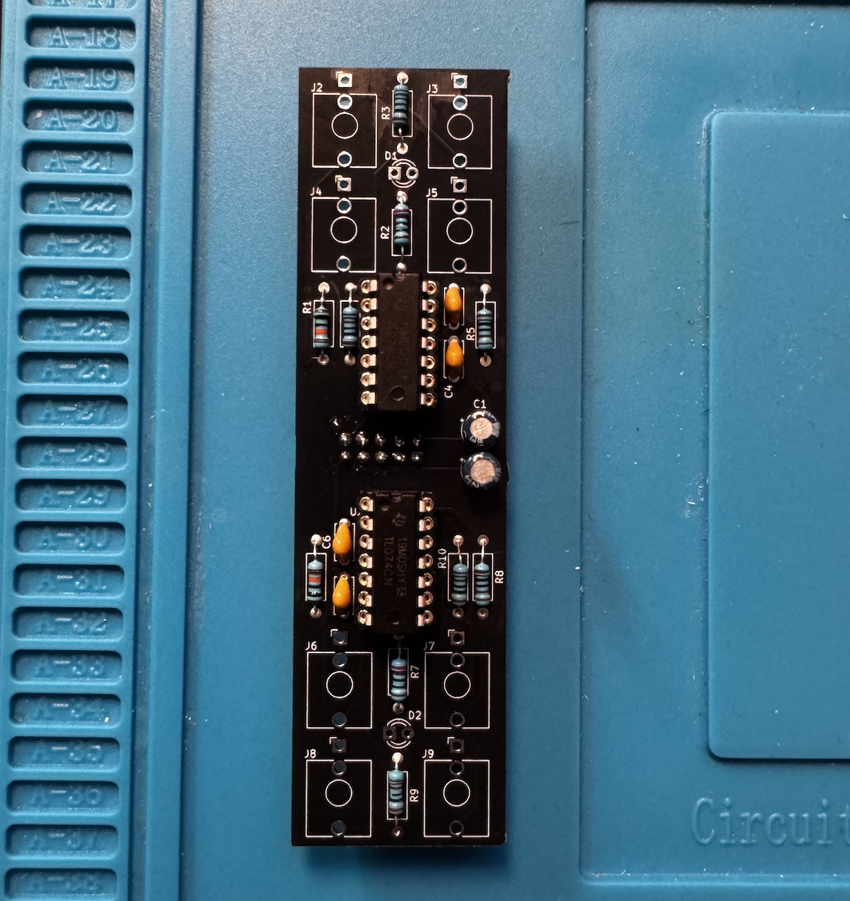

# multbuf

A simple dual buffered multiple module with LED indicating the polarity of the input signal, printed with panel. Make sure to remove order number.

Schema file: [link](./multbuf.pdf)
PCB ready for pinting: [link]('./pcb.zip') 

## PCB

Pcb is fully through hole and easy to solder. Note that power connector should be soldered from the other side

## BOM

| Reference          | Value | Qty | Comment                    |
|--------------------|-------|-----|----------------------------|
| C1,C2              | 10uf  | 2   | 35V Electrolytic capacitor |
| C3,C4,C5,C6        | 100nf | 4   |                            |
| D1                 | LED1  | 1   | bipolar LED                |
| D2                 | LED2  | 1   | bipolar LED                |
| J1                 | POWER | 1   | 2x5 POWER Connctor         |
| J2                 | IN1   | 1   | Thonkiconn - 3.5mm Jack    |
| J3                 | OUT11 | 1   | Thonkiconn - 3.5mm Jack    |
| J4                 | OUT12 | 1   | Thonkiconn - 3.5mm Jack    |
| J5                 | OUT13 | 1   | Thonkiconn - 3.5mm Jack    |
| J6                 | IN2   | 1   | Thonkiconn - 3.5mm Jack    |
| J7                 | OUT21 | 1   | Thonkiconn - 3.5mm Jack    |
| J8                 | OUT22 | 1   | Thonkiconn - 3.5mm Jack    |
| J9                 | OUT23 | 1   | Thonkiconn - 3.5mm Jack    |
| R1,R6              | 100K  | 2   | 1/4 W                      |
| R2,R7              | 330   | 2   | 1/4 W                      |
| R3,R4,R5,R8,R9,R10 | 1K    | 6   | 1/4 W                      |
| U1,U2              | TL074 | 2   |                            |
